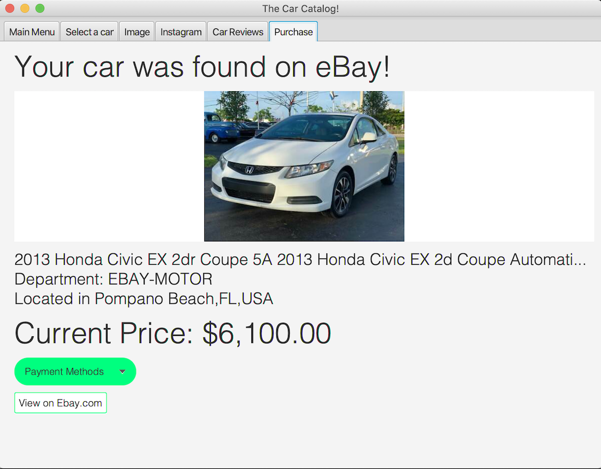

# CarTester
A JavaFX application that simplifies the process of researching vehicles online (looking for reviews, sellers, images).

## Main Menu
The main menu includes an interactive table that displays a large selection of cars, in alphabetical order, based on their make. The user has the option to filter the table by searching for a specific make or model name.

There are a variety of other (optional) tools to help the user perform the search, including:
* A slider to set the max price range
* An animated pallette for the user to specify what colour they are looking for
* An option to only look for nearby sellers or convert prices to their local currency (The program automatically determines the user's location based on their IP address)
* A drop-down list of cars from the user's previous searches

Once the user has found their model, they can either double click it's entry on the table, or select the "Get Car" button t start the search process.

The program then performs a series of searches using different API's and displays all the results in different tabs:

## Images (Bing + Instagram)
A search is made using the Bing Image Search API using a query of the form "colour [optional] year make model", and the top image results are shown. The user also has the option save the image.

Additionally, they can search for the car's name as an Instagram hashtag (with the colour and year omitted). For example, the following results would be shown for *"White 2008 Honda Civic":*

## Ebay
The car is also searched for using eBay's product searching API (with the appropriate search filters specified by the user in the main menu). Any relevant results are shown on the "Ebay" Tab, along with the current price, seller's location, and a drop-down list of the available payment options (specific to different products).

There is also an option to view the product on eBay itself

## Video Reviews
A YouTube search for the car is also performed automatically. The program allows the user to view the video review directly within the application. (The results for this search tend to not be very accurate at the moment)

## Future improvements under development
### Directions to nearby seller (Using GMapsFX)

### Car Recognition (Using SightHound Computer Vision API)
This feature would allow the user to upload an image of a car from their computer, for situations where they took a picture of a car but cannot identify it to perform the search

## Automatic translation of interface to different languages

## Improvements to the GUI using SceneBuilder
